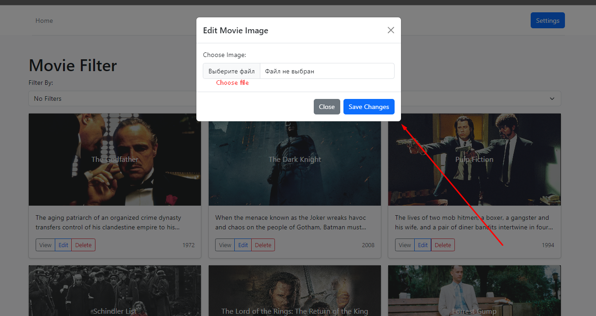

<h1 align='center'>OOP Movie App</h1>

<h2>Technologies stack:</h2>
<ol>
    <li>
        <h3>Back-End:</h3>
        <ul>
            <li>Java</li>
            <li>Spring Boot</li>
            <li>Thymeleaf</li>
        </ul>
    </li>
    <li>
        <h3>DataBase:</h3>
        <ul>
            <li>sqlite</li>
        </ul>
    </li>
    <li>
        <h3>Front-End:</h3>
        <ul>
            <li>HTML</li>
            <li>CSS</li>
            <li>Java Script</li>
        </ul>
    </li>
</ol>

<h2>Home page</h2>

<h2>Home page authentication</h2>

User is shown in right top corner

<h2>Home page admin</h2>

Admin can delete movies or change movie background

<h2>Sign In</h2>

<h2>Login</h2>

<h2>Admin Settings Page</h2>

Admin can delete users

<h2>Movie Details Page</h2>

All comments are shown in movie detail page

<h2>Comments Not Auth</h2>

Only authorized users can add comments

<h2>Admin Add Movies</h2>

Admin can add new movies

<h2>Ďalšie kritériá:</h2>
<ul>
    <li>
        
použitie návrhových vzorov okrem návrhového vzoru Singleton – každý implementovaný návrhový vzor sa počíta ako splnenie jedného ďalšieho kritériá, ale implementácia všetkých návrhových vzorov sa posudzuje maximálne na úrovni splnenia troch ďalších kritérií

        
        
        
Splnene (Observer pre admina na generovanie reviews, Factory pre 'Entities', Proxy pre movies)

    </li>
    <li>
        
ošetrenie mimoriadnych stavov prostredníctvom vlastných výnimiek – stačí jedna vlastná výnimka, ale musí byť skutočne vyhadzovaná a ošetrovaná

        
        
        
Splnene (IOException, MovieNotFoundException, ReviewNotFoundException, UserNotFoundException)

    </li>
    <li>
        
poskytnutie grafického používateľského rozhrania oddelene od aplikačnej logiky a s aspoň časťou spracovateľov udalostí (handlers) vytvorenou manuálne – počíta sa ako splnenie dvoch ďalších kritérií

        
        
        
Splnene (Java v subore java; HTML, CSS, JS v subore resources)

    </li>
    <li>
        
explicitné použitie viacniťovosti (multithreading) – spustenie vlastnej nite priamo alebo prostredníctvom API vyššej úrovne (trieda Task a pod.)

        

        
Splnene (mam multistreaming a api taktiež aj spolu s Thymeleaf)

    </li>
    <li>
        
použitie generickosti vo vlastných triedach – implementácia a použitie vlastnej generickej triedy (ako v príklade spájaného zoznamu poskytnutého k prednáške 5)

        

        
Splnene (1: Person ktory extendujem v User a Admin; 2: Blank ktory extendujem v Movie a Comment, 3: JPARepository, ktory použivam v repozitaroch)

    </li>
    <li>
        
explicitné použitie RTTI – napr. na zistenie typu objektu alebo vytvorenie objektu príslušného typu (ako v hre s obrami a rytiermi pri zisťovaní počtu bytostí)

        

        
Splnene (mam v kode typeof)

    </li>
    <li>
        
použitie vhniezdených tried a rozhraní – počíta sa iba použitie v aplikačnej logike, nie v GUI, pričom rozhrania musia byť vlastné (jedna možnosť je v príklade vnútorných tried k prednáške 4)

        

        
Splnene (ano)

    </li>
    <li>
        
použitie lambda výrazov alebo referencií na metódy (method references) – počíta sa iba použitie v aplikačnej logike, nie v GUI (jedna možnosť je v príklade referencií na metódy a lambda výrazov k prednáške 4)

        

        
Splnene ("::")

    </li>
    <li>
        
použitie implicitnej implementácie metód v rozhraniach (default method implementation)

        

        
Splnene (ano)

    </li>
    <li>
        
použitie aspektovo-orientovaného programovania (AspectJ)

        

        
Splnene (pre logovanie LoggingAspect)

    </li>
    <li>
        
použitie serializácie

        

        
Splnene (Review implements Serializable)

    </li>
</ul>
