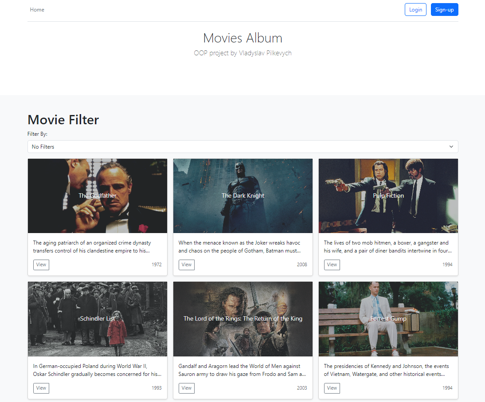
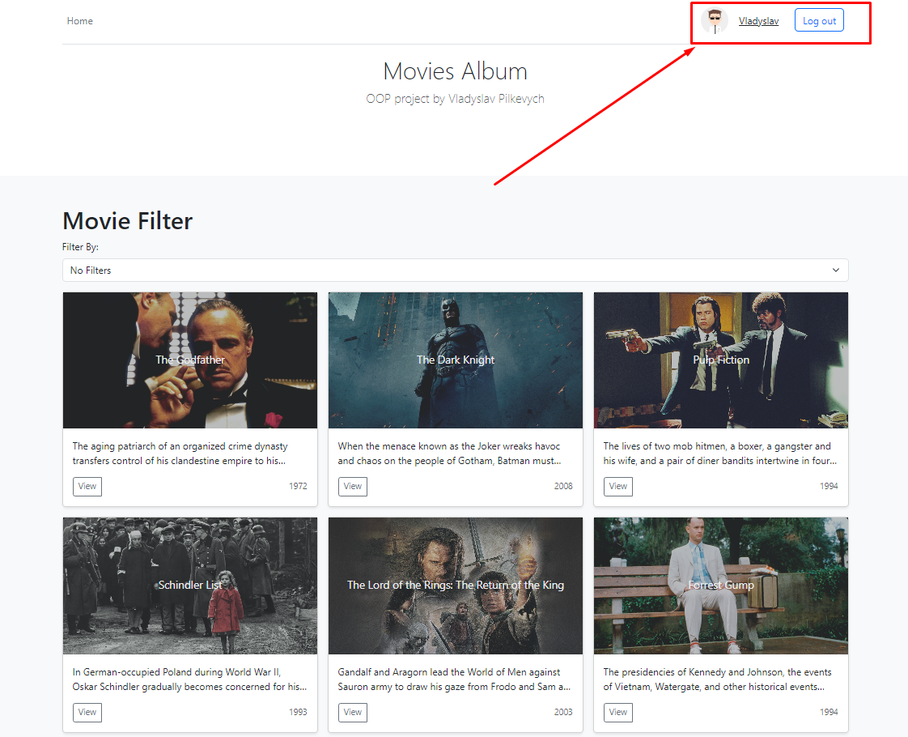
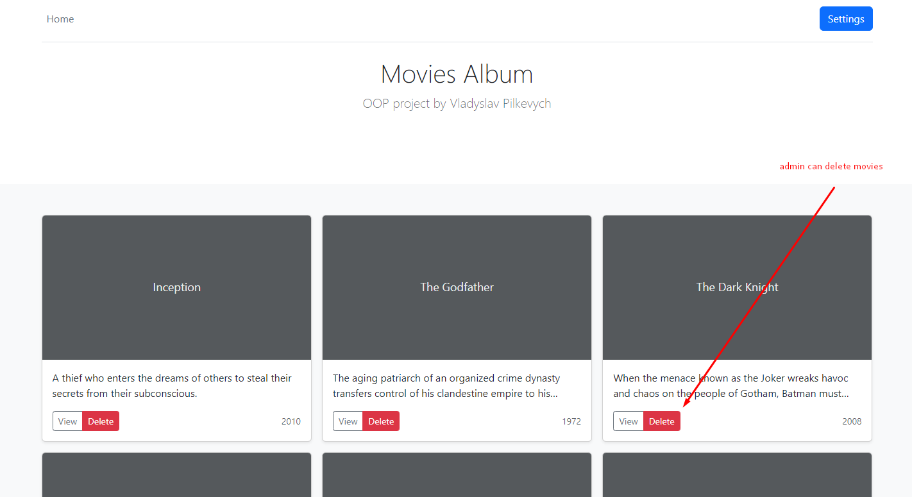
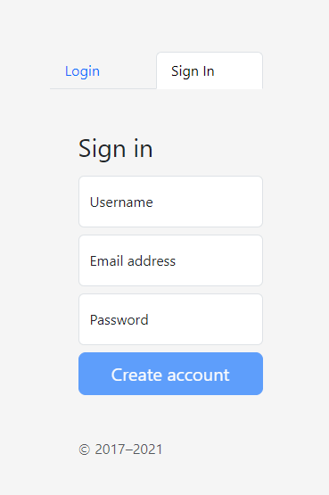
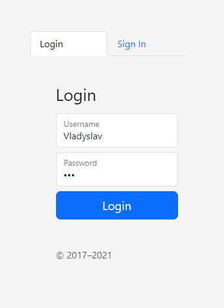
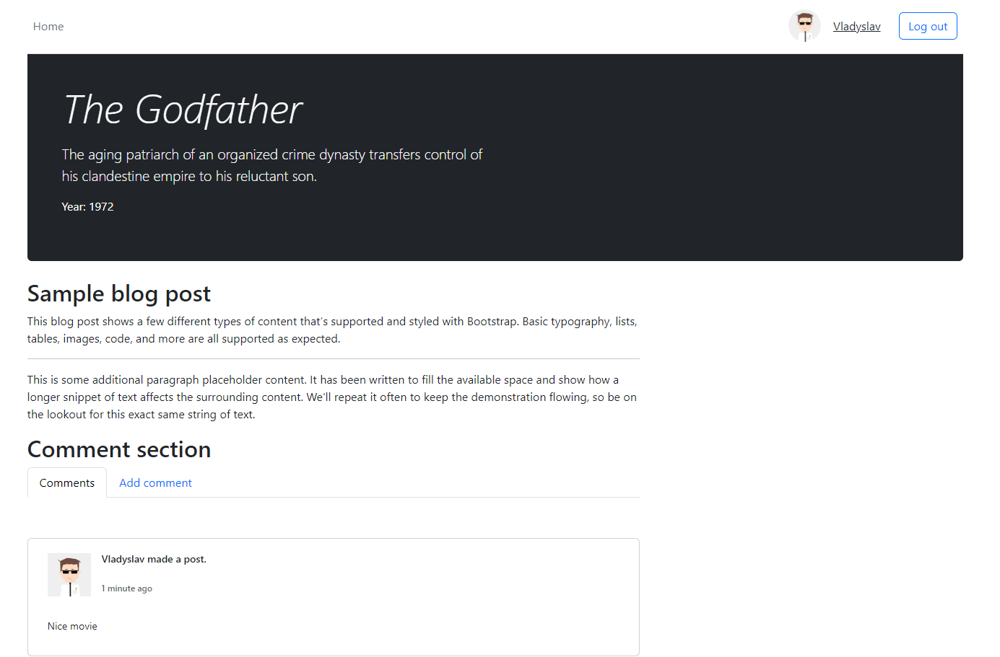
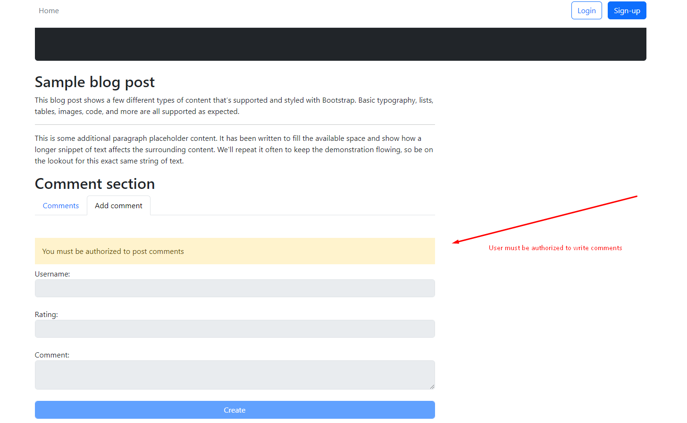
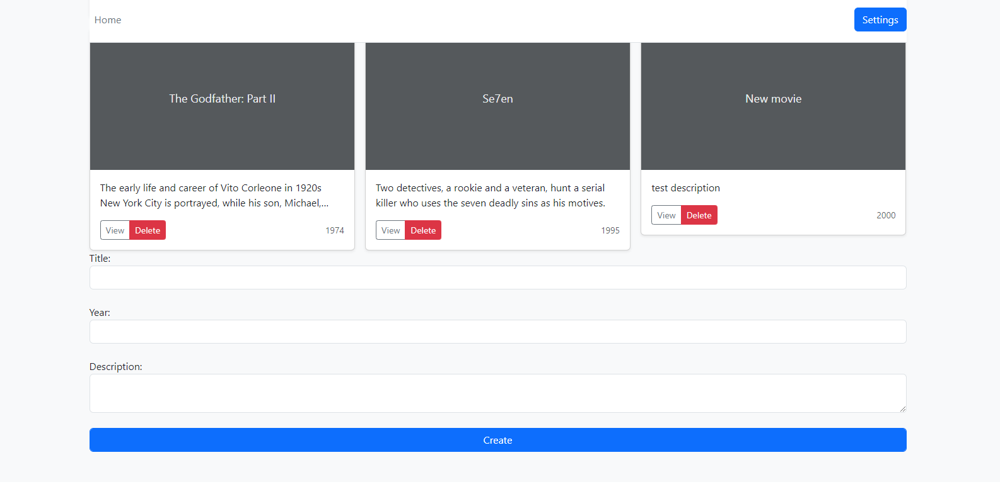

<h1 align='center'>OOP Movie App</h1>

<h2>Technologies stack:</h2>
<ol>
    <li>
        <h3>Back-End:</h3>
        <ul>
            <li>Java</li>
            <li>Spring Boot</li>
            <li>Thymeleaf</li>
        </ul>
    </li>
    <li>
        <h3>DataBase:</h3>
        <ul>
            <li>sqlite</li>
        </ul>
    </li>
</ol>

<h2>Home page</h2>

<h2>Home page authentication</h2>

User is shown in right top corner

<h2>Home page admin</h2>

Admin can delete movies

<h2>Sign In</h2>

<h2>Login</h2>

<h2>Admin Settings Page</h2>

Admin can delete users

<h2>Movie Details Page</h2>

All comments are shown in movie detail page

<h2>Comments Not Auth</h2>

Only authorized users can add comments

<h2>Admin Add Movies</h2>

Admin can add new movies

