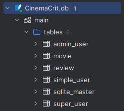
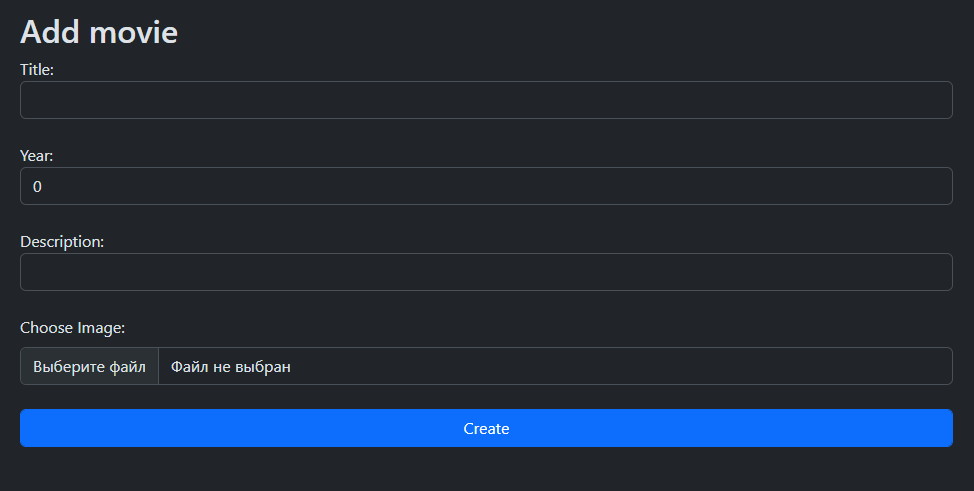
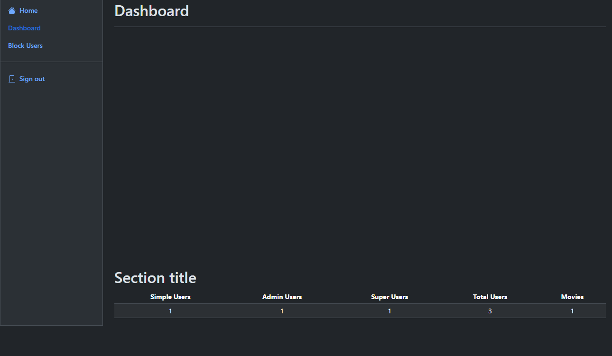
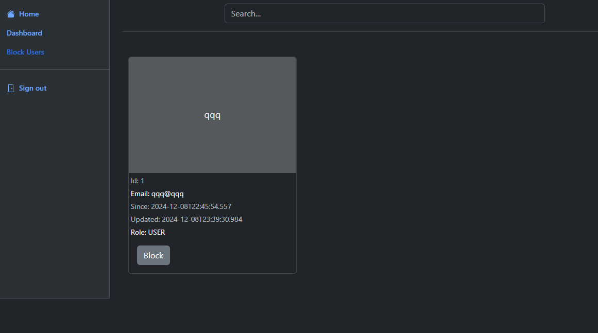
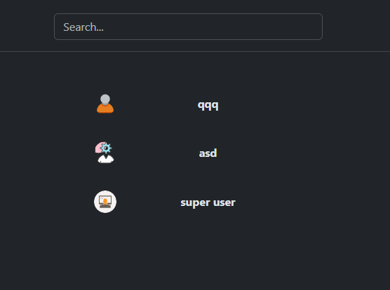
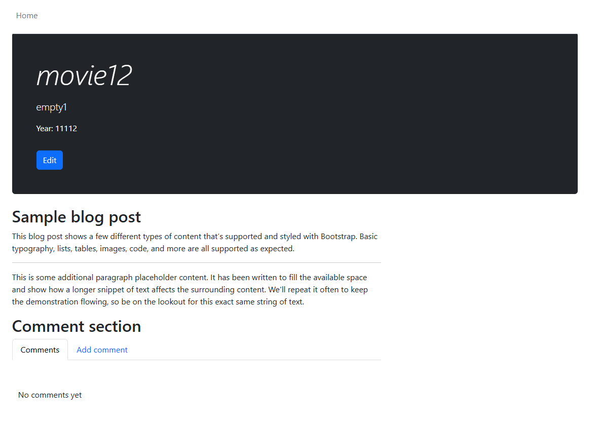
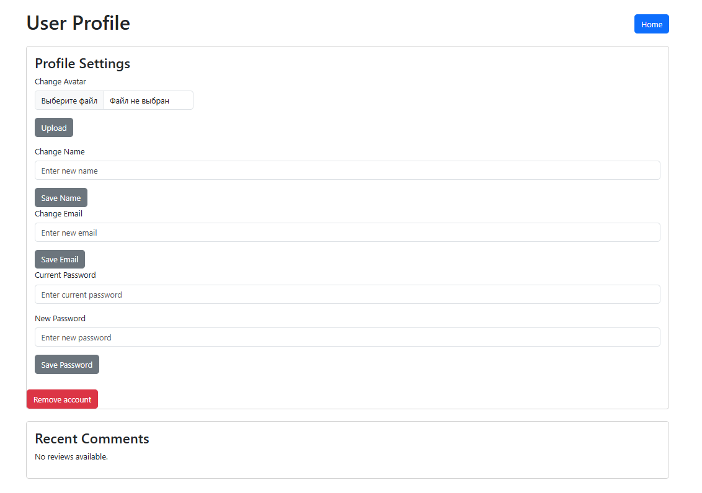
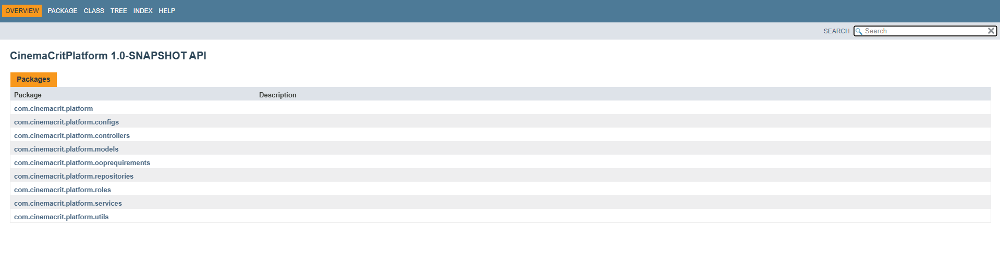
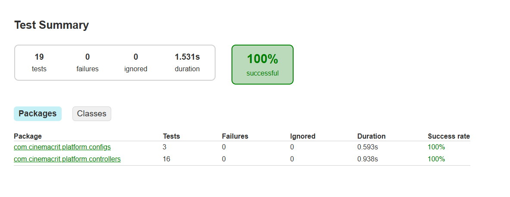

# OOP Cinema Crit Platform

## Overview

The Movie Critic App is a web application built with **Spring Boot** that allows users to interact with movie data. It supports three user roles: **SimpleUser**, **Admin**, and **SuperUser**. Admin and SuperUser roles can create and edit movies, while SimpleUser can leave comments on movies, remove them, and change their avatar.

## Features

- **Roles**:
    - **SimpleUser**: Can leave comments on movies, remove their own comments, and change their avatar.
    - **Admin**: Can create, edit, and delete movies.
    - **SuperUser**: Has the same permissions as Admin but with elevated privileges.

- **Movies**: Users can view movies, and Admin/SuperUser can create and edit them.
- **Comments**: SimpleUser can leave comments on movies and delete their own comments.
- **Avatar**: Users can update their profile avatar.

## Dependencies

This project uses several dependencies, including Spring Boot and other related libraries. Here's an overview of the key dependencies:

### Core Dependencies

- **Spring Boot**: The main framework used to build the application.
    - `spring-boot-starter-thymeleaf` - Provides integration with Thymeleaf templating engine for rendering views.
    - `spring-boot-starter-security` - Adds security features, enabling user roles and authentication.
    - `spring-boot-starter-web` - Enables web functionality, including REST APIs and MVC.
    - `spring-boot-starter-data-jpa` - Provides JPA support for database operations.

- **Database**:
    - `sqlite-jdbc` - Used to interact with an SQLite database for storing movie and user data.
    - `hibernate-community-dialects` - Supports dialects for Hibernate ORM.

- **Thymeleaf Security Integration**:
    - `thymeleaf-extras-springsecurity6` - Enables Thymeleaf integration with Spring Security to display user-specific content based on roles.

### Testing Dependencies

- **JUnit**: Used for unit testing.
    - `junit-jupiter` - The Jupiter API for JUnit 5.
    - `mockito-core` - For mocking objects in tests.
    - `mockito-junit-jupiter` - Integrates Mockito with JUnit 5.
    - `assertj-core` - Provides fluent assertions for tests.
    - `spring-boot-starter-test` - Includes essential testing components for Spring Boot applications.

### Versioning

- **Java**: This project is built with **Java 21**.
- **Spring Boot**: Version 3.2.x

# Screenshots

## Databases

## Sign In

## Registration

## Movies home page

## Create movie

## Admin/SuperUser dashboard

## Admin/SuperUser blocked list

## Admin/SuperUser users list

## Movie info

## Edit movie for admin/superuser

## User profile settings

# Bonus

## Javadoc

## Tests

